# Exploring the Limits of Transfer Learning with a Unified Text-to-Text Transformer

Created: Nov 08, 2019 5:52 PM
Created By: Leo Kim
Last Edited By: Leo Kim
Last Edited Time: Nov 12, 2019 4:36 PM

# Abstract

1. NLP 도메인에 존재하는 다양한 문제들을 하나의 통일된 프레임웍을 이용해서 해결 하고자 함
    - 프레임웍 기반 기술 : Transfer learning using Transformer
        - 최근 다양한 변이가 많음 : 실험을 통해 최적의 모델을 찾고자 함
        - 고려한 옵션 : Pre-training Architect, Pre-training Objective, Corpus 등..
    - 입출력 방법 : text-to-text(encoder-decoder)
        - 모든 문제를 text-to-text 형태로 변경해서 해결하도록 함
        - 예를 들어, classification 문제도 라벨을 분류하는게 아니라 decoder에서 text를 생성해 내는 형태

2. Summarization, QA, Text Classification 등에서 SOTA를 달성

3. 관련 코드: [https://github.com/google-research/text-to-text-transfer-transformer](https://github.com/google-research/text-to-text-transfer-transformer)

# 1. Introduction

1. Pre-Training 모델의 변천사 및 왜 이 모델이 필요한지에 대한 간단한 이야기들
2. Seq-to-Seq 변천사 및 특징, 그리고 왜 text-to-text 까지 왔는가.
3. 쭉 읽고 다 이해가 가면 당신은 nlp 도메인 최신 모델들을 잘 따라오고 있는 사람~
4. 모두연 발표시 간단히 정리한 PPT(Perceptron to ALBERT in NLP) 발표 예정

# 2. Setup

- "Text-to-Text Transfer Transformer(T5)" 모델과 학습 코퍼스 "Colossal Clean Crawled Corpus(C4)"에 대한 기본적인 설명

## 2.1 Model

1. 일반적인 Transformer 형태

## 2.2. The Colossal Clean Crawled Corpus

1. Common Crawl을 발전 시켜 사용
    - 한달에 약 20TB정도 수집
    - 수집시 HTML tag등의 마크업 이나 Non-text 들은 제거됨
    - 그러나, 수집한 모든 내용에 메뉴나 에러 메세지 등도 있음 ⇒ Heuristic Cleanup 진행
        - terminal punctuation mark (i.e. a period, exclamation mark, question mark, or end quotation mark).로 끝나는 문장 Only
        - Javascript 워닝으로 시작 or Javascrip 라인 날리기
        - "lorem ipsum"이 포함된 페이지 버리기
        - “List of Dirty, Naughty, Obscene or Otherwise Bad Words” = 나쁜 단어 포함된 것 버리기
        - { }와 같은 코드가 포함된 것 버리기
        - 대부분의 Downstream Task가 영어이기 때문에, langdetect을 사용하여 영어일 확률이 0.99 이하인 것은 모두 제거하였음
    - 총 750 GB정도 모였고, TensorFlow Dataset에 공유

## 2.3.Downstream tasks

- 언어에 대한 일반적인 능력을 보기 위해서, GLUE, SUPER GLUE, 번역, QA, 요약, 분류 등 전 방위에 걸쳐 테스트를 진행함

## 2.3.Input and output format

1. Unified Text-to-Text 모델이기에 입력되는 인풋에 진행하고 싶은 Task 정보가 필요
    - 입력 Text 앞에 Task 구분 가능한 prefix를 붙임
    
2. 모든 문제를 Text-to-Text 모델로 처리 하기 위해 특정 형태의 Task는 몇 가지 트릭(?)을 사용
    - MNLI(Classification Tasks)
        - Input : "mnli premise: I hate pigeons. hypothesis: My feelings towards pigeons are filled with animosity."
        - Output : "entailment"
        - 참고 : classification 문제이지만, Text-to-Text 어프로치의 특성상, 정답 후보가 될 수 있는 라벨외에 단어가 생성될 수 있음. 이 경우 그냥 정답이 틀렸다고만 하고 다른 어떤 행위도 하지 않음
    - STS-B(Regression Tasks)
        - 1~5사이의 유사도 스코어를 리그레션 하는 문제
        - 대부분의 케이스에서 유사도가 0.2단위로 증가 / 감소 ⇒ 1, 1.2, 1.4, 1.6 ~ 4.8, 5
        - 21개 클래스를 가진 클래스 분류 문제로 변환해서 진행
    - DPR(Winograd Tasks)
        - 찾아야 할 pronoun의 위치를 표시해야 함
        - Input : "...because *thay* feared violence..."
        
3. 그 외에도 WSC를 위해서는 Ture 라벨만 사용한다던지 등의, 테스크별 추가 변환을 진행한 것들이 있음

# 3. Experiments

1. 위에서 설명한 모델을 기본으로 해서, 다양한 조합의 실험을 진행하여 최고의 조합을 찾을 예정.
2. 최근 나온 SOTA 찍었었던 모델들에서 인사이트를 찾아서 진행.
3. 같은 형태의 프레임웍을 유지하면서 다양한 Task가 동작하는 것이 보장되도록 실험 진행.
4. BERT와 같이 Encoder-Only Structure는 분류 등 언어 이해 관련 테스크에서는 탁월하지만, 번역 등 생성 모델 관련 테스크(Text-to-Text 어프로치 자체가 이해와 생성 모두 필요하기에)에는 적합하지 않기 때문에 고려하지 않음.

## 3.1 Baseline

1. "Standard Transformer using a simple denosing objective "방법 사용

    ### 3.1.1 Model

    1. Standard encoder-decoder Transformer
    2. 파라메터 사이즈는 Bert Base 로 세팅 : 모델 전체 사이즈는 220 million param (Bert Base의 2배)
    3. Generative나 Classification에서 모두 좋은 성능을 보였음

    ### 3.1.2 Training

    1. Task 는 text-to-texst테스크 (standard max. likelihood)
    2. learning rate schedule에 Inverse square root 활용
    3. Pretrain: 524,288steps / Finetune: 262,144steps (2^19 / 2^18)
    4. seq-length : 512 
    5. batch size : 128 sequences

    ### 3.1.3 Vocab

    1. Sentenpiece library를 이용하여 Wordpiece 진행 (32,000개 단어)
    2. 번역 Task도 있기 때문에 영어 외의 언어도 커버 필요 : German, French, Romanian
        - C4 말뭉치의 1/10 사이즈의 크기로 각각의 언어 말뭉치를 추가 해서 wordpiece 진행
        - 10:1:1:1로 학습 (영어 - 독일어, 불어, 로마어) → 결국 C4데이터 의 1.3배

    ### 3.1.4 Unsupervised obj.

    1. 예전에는 Language Modeling 방법이 많이 사용 되었지만, 최근에는 Denosing 방법이 좋은 성능을 보여 주고 있음.
    2. 아래는 베이스라인 모델에서 사용된  Denosing Objective 임.
    3. 연속된 토큰도 1개로 마스킹
    4. <Z>는 EOS
    5. 근데 실제로 문장에 <X>같은 형태(<알파벳>)의 단어가 있다면 문제가 될듯?

    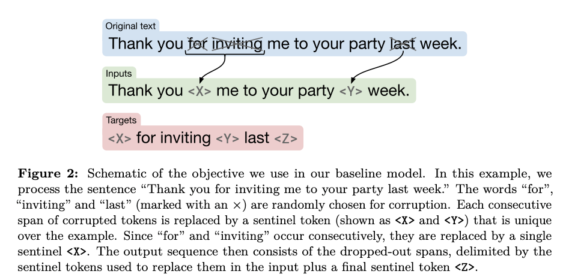

    ### 3.1.5 Baseline performance

    1. 10개의 베이스라인을 동시에 학습 시켜서 평균과 표준편차를 확인
    2. BERTBase모델보다는 성능이 올랐지만 직접적으로 비교가 어려운 이유는 Encoder-Decoder모델이기 때문이고 pre-train을 버트에 비해 학습을 1/4 만 진행했기 때문임
    3. Pretrain은 역시 잘 알려졌듯이 성능 향상에 효과적임

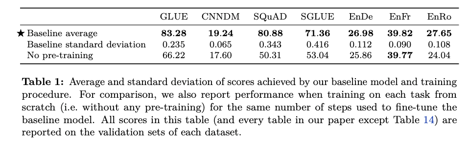

## 3.2 Architectures

1. 다양한 Transformer Architecture들에 대해 정리하고 실험 진행

    ### 3.2.1 Model Structure

    1. Attention masks
        - 모델의 성능에 영향을 줄 수 있는 중요한 요소 중에 하나로 아래 3가지 형태를 고려
        - Fully-visible : 출력단어(Query)가 모든 입력단어(Key)에 attention 할 수 있음
            - Self-attention이라면 Transformer encoder 쪽
        - Causal : 출력단어(Query)가 자신의 현재 포함 이전 타임 스텝의 입력단어(Key)에 attention 가능
            - Self-attention이라면 Transformer decoder 쪽
        - Causal with prefix : 출력단어(Query)가 자신의 현재 포함 이전 타임 스텝의 입력단어(Key)와 일정 길이의 prefix단어(key)에 attention 가능

        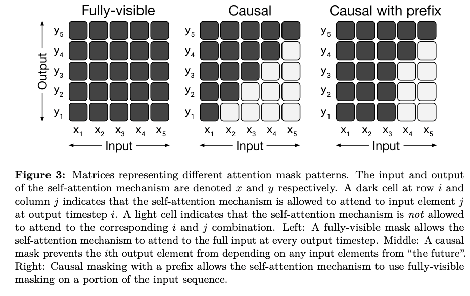

    2. Encoder-Decoder
        - Encoder : self-attention with Fully-visible
        - Decoder : self-attention with Causal
    3. Language Model
        - Using only Decoder : self-attention with Causal
    4. Prefix LM
        - Text-to-Text 구조에서 입력 문장 전체의 정보를 이용하지 않을 이유가 없음.
            - 그런데, LM은 입력 문장에서 조차 이전 스텝의 단어에만 어텐션 가능
            - 입력 Text에 대해서는 transformer encoder에서 해결한 것 처럼 AE 방법을,
            - 출력 Text에 대해서는 한 단어씩 생성해야 하니, AR방법을 사용하자
        - LM과 같은 구조이지만, 입력 부분에 대해서는 Fully-visible 방법 사용(입력부분이 prefix)

    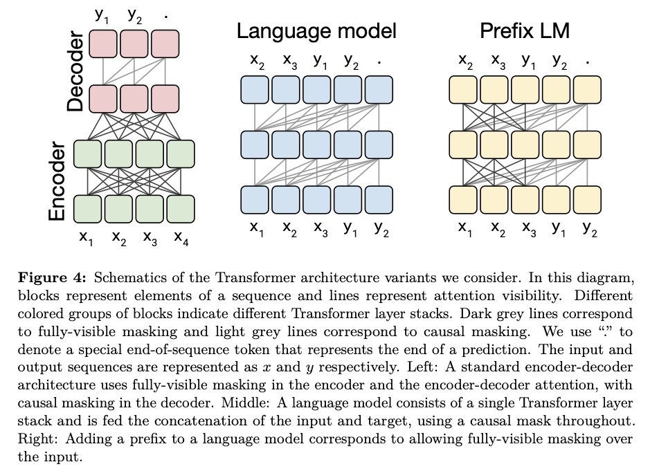

    ### 3.2.2 Comparing different model structures

    1. 직접적으로 동일한 비교가 힘든 경우가 있더라도, 최대한 다양한 방법으로 비교 진행.
    2. 기본 파라메터 셋팅은 BERT base

    ### 3.2.3 Objective

    1. 일반적인 LM 모델과 denoising objective 실험

    ### 3.2.4 Result

    1. Encoder - Decoder with denoising objective performed best.
    2. Sharing 자체도 파라메터가 반으로 줄었는데도 성능이 크게 차이 안남
    3. Layer를 줄이는 것은 성능에 크게 악영향을 주었음

    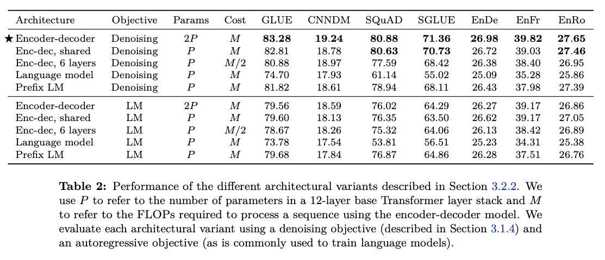

## 3.3 Unsupervised objectives

1. Objective의 종류가 많고, 각 Objective별로 실험해 봐야할 세부 하이퍼 파라메터수가 너무 많음
    - 실질적으로 모든 케이스를 실험하는 것은 불가능
    - 그래서 Greedy 탐색 처럼 중요 요소부터 가장 성능이 좋게 나오는 설정의 하위 설정들을 테스트.
    - 모든 케이스를 실험한다면, 어쩌면 더 좋은 설정을 찾을 수도 있음.
2. 기존에 있는 objective를 text2text에 맞게 수정

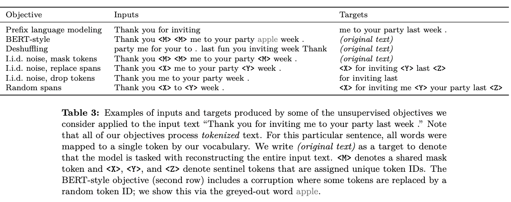

### 3.3.1 Disparate high-level approaches

1. 크게 3가지 형태로 분류해서 실험 : Prefix LM, BERT-style, Deshuffing
    - BERT Style Objective가 제일 잘함
    - Deshuffling은 성능을 떨어트림

    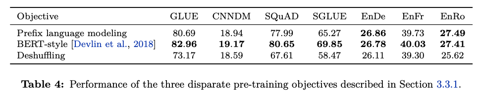

### 3.3.2 Simplifying the BERT objective

1. 처음에 이야기 한대로 그리디 탐색 방법으로 최적 조합을 찾을 예정
⇒ BERT Style 방법이 가장 좋다고 가정하고 디테일한 하위 요소들을 실험.
⇒ 하위 요소: Objective 방법
2. BERT 스타일의 Objective들을 사용한 대표 방법들을 실험
3. Random token swapping step 제외하고 실험 진행
4. 디코더에서 self-attention을 통해 긴 sequence가 필요한 부분을 피하기 위해, 원본 문장 전체를 예측하지 않는 방법을 고민.
5. Replace corrupted spans가 성능 젤 좋음(Baseline 모델에 적용된 것)

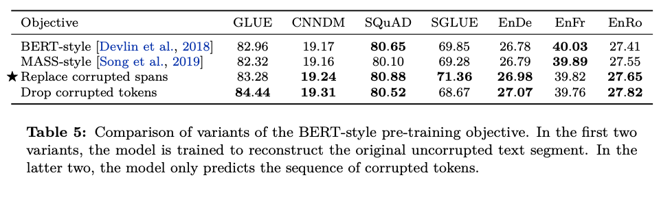

### 3.3.3 Varying the corruption rate

1. Corruption rate 변화에 따른 성능 확인
    - 15%가 제일 성능 좋음

    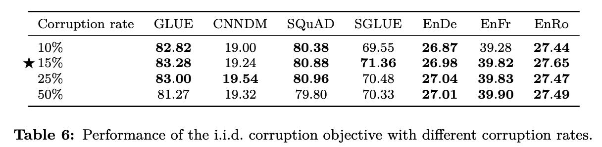

### 3.3.4 Corruptiong Spans

1. Corruption span length 변화에 따른 성능 확인

    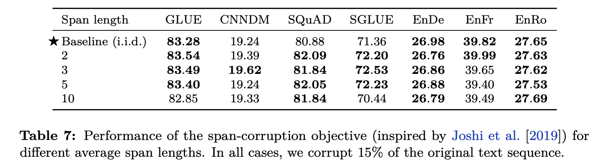

### 3.3.5 전체 결과 그림

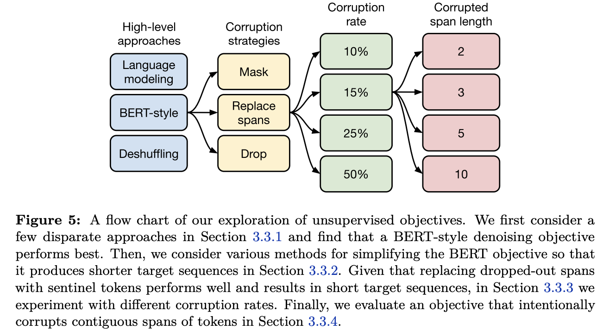

## 3.4 Pre-training dataset

1. 프리트레이닝 데이터 셋이 성능에 미치는 영향을 확인

    ### 3.4.1 Unlabeld datasets

    1. 테스트한 데이터 종류
        - C4 : Section 2.2에 설명
        - Unfilterd C4 : langdetect로 영어만 추린 것(C4를 만들기 위해 사용한 휴리스틱 적용안함)
        - RealNews-like : C4 데이터에서 RealNews 방법으로 필터링
        - WebText-like
            - WebText dataset은 사용자들이 해당 웹페이지 contents 퀄리티에 따른 점수를 주는데, 해당 점수를 1~3점 사이로 계산해둔 스코어를 함께 가지고 있음.
            - 해당 WebText dataset을 이용해서 높은 스코어의 url과 겹치는 페이지만 남김
            - 하지만, C4는 한달치 데이터라서 남은 데이터가 2GB 밖에 안됨.
            - 12달치를 사용해서 17GB데이터를 만들어냄
        - Wikipedia : 영어 위키
        - Wikipedia + Tronto Books Corpus
            - 다양한 도메인 정보를 추가하기 위해서 TBC  추가
    2. 테스트 결과
        - C4가 전체적으로 성능이 좋음
        - 인 도메인 데이터로 학습하면, 해당 다운스트림 테스크의 성능이 좋아진다는 교훈을 얻음
        (wiki, book..  → MRC)
        - WebText의 성능을 보았을때, C4보다 훨씬 데이터가 적음에도 불구하고 높은 성능을 내서, 원인 분석이 필요

    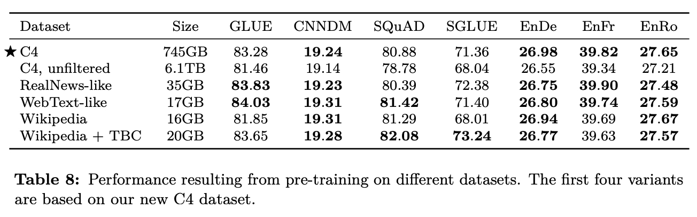

    ### 3.4.2 Pre-training data size

    1. Data size에 따른 변화 확인
        - 데이터 사이즈가 충분히 크다면, 같은 데이터로 여러번 학습 하는 것 보단, 매우 많은 데이터로 적은 횟수를 학습하는 게 더 낫다.
            - 다운스트림에서의 커버리지
            - 적은 데이터로 반복 학습시 암기(?)하는 효과가 나타남 ⇒ 오버피팅의 느낌 인듯.
            - 실험 결과, 64회 정도의 반복은 위의 암기하는 효과가 제한 되는 듯 하다고 함
        - 결론 : 데이타는 다다익선, 반복은 64회 정도.

        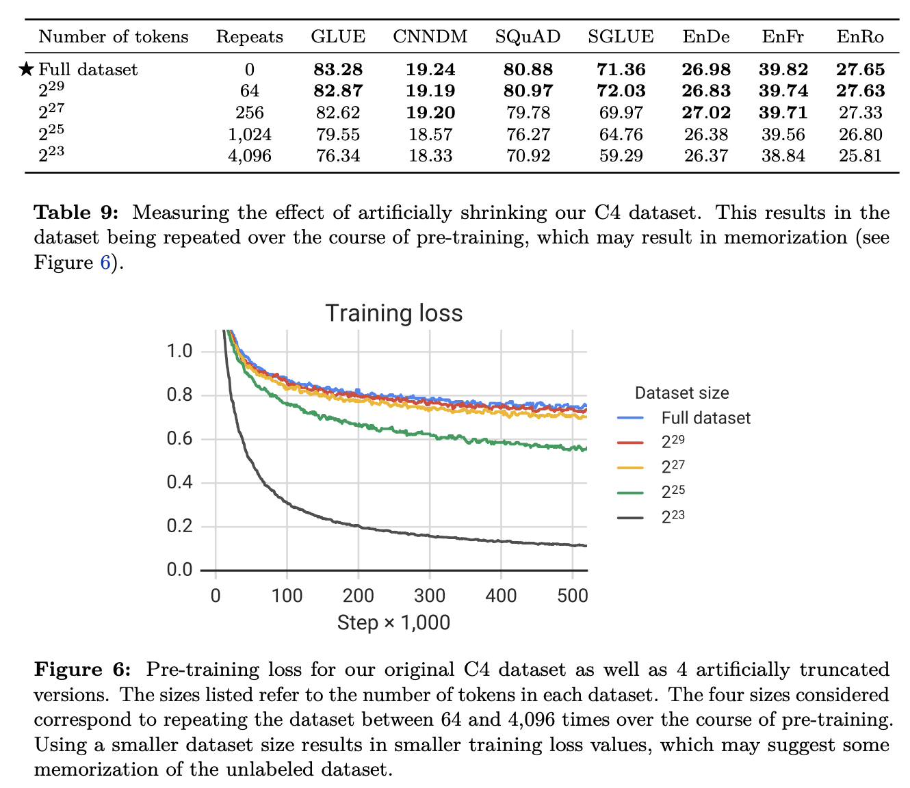

## 3.5 Training Strategy

1. Dawnstream/Supervised task를 위한 fine-tunning 방법에 대한 실험들을 정리

    ### 3.5.1 Fine-tuning methods

    1. 모든 파라메터를 다 파인튜닝 하는 것은 좋지 않다고 알려져 있음 (특히나 튜닝 데이터가 적을 때)
        - Pre-Trained 된 것은 고정, 뒷 단의 분류기 레이어 들만 새로 학습하는 형태 선호
        - 그러나, Encoder-Decoder 방법에 적용하기 힘듬 : 디코더 파트 때문

            ⇒ 그래서 다른 대안으로 두 가지 방법을 제시

    2. Adapter layers
        - 파인 튜닝 동안 대부분의 오리지날 모델을 그대로 유지하는 것이 컨셉
        - Transformer Layer 내에 Feed-Forward Layer 뒤에 "Adapter Layer"를 추가 해서 학습하는 방식

            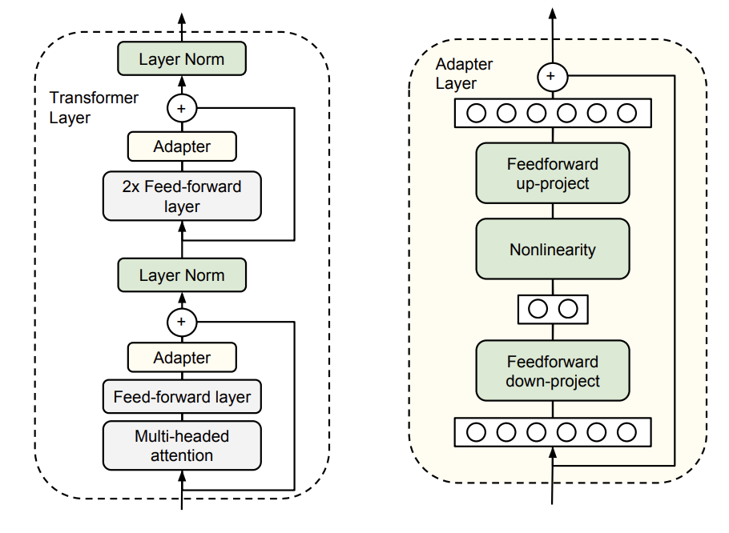

        - Adapter Layer내의 프로젝션 되는 차원 수는 하이퍼 파라메터 : T5에서는 d로 두고 실험
    3. Gradual unfreezing
        - 모든 레이어를 함께 파인 튜닝 하지 말고, 마지막 레이어 부터 천천히 파인 튜닝해 가는 방법.
        - 이터레이션 마다 레이어 하나씰 풀어가기.
        - 전체를 얼려두고 마지막 레이어 부터 녹여가는 느낌.
    4. 결과 분석
        - 작은 리소스를 필요로 하는 테스크 하나만 목표로 할 경우 d값이 클 필요는 없음.
        - 단, 여기서는 GLUE와 SuperGLUE 를 각각 하나의 테스크로 생각하고 학습 했기 때문에 리소스 크기가 매우 크다고 생각할 수 있고, 그래서 d 값이 커야 했음.
        - Gradual unfreezing 방법은 파인 튜닝 속도 향상에는 도움이 되지만, 약간의 성능 향상을 가져왔음. 그러나 좀더 신종한(?) 튜닝을 진행하면 좋은 성능을 가져올 수 있을수도 있음.

            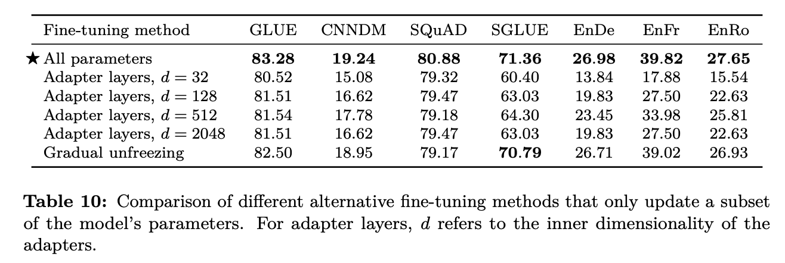

    ### 3.5.2 Multi-task learning

    1. Text-to-Text 에서 multi-task learning은 단순히 데이터 집합을 혼합하는 개념!
        - 어떤 테스크의 데이터를 얼마나 가져와서(혹은 어떤 비율로) 학습하는지가 중요
        - 그것들을 결정할 수 있는 요소 들은 "작업 학습의 난이도, 정규화, 테스크간 간섭성 (?한글 단어가 참... )" 등이 있는데, 그걸 고려해서 데이터 비율 찾는 방법을 찾아 보려함.
    2. Example-Proportional mixing
        - 각 테스크 별 데이터셋 사이즈에 비례해서 샘플링 : 즉 전체 데이터를 샘플링 한다는 의미.
        - 그러나 하나의 테스크가 데이터 셋이 매우 크거나 작은 경우 문제가 있음.
        - 그걸 해결하기 위해 약간의 제한을 둠
            - K = 인공적으로 정한 최대 데이터 사이즈

                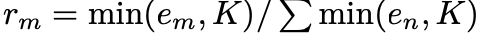

    3. Temperature-scaled mixing
        - multilingulal BERT 에서 사용한 방법
        - Soft-max에서 Calibration을 위해 사용하는 Temperature-scaled 방법과 같은 접근.
        - 각 데이터를 T로 나누고 한덩이 씩 만 합치게 하는 느낌.
        - T가 1이면 Example-Proportional mixing와 같고 T가 무한대로 커지면 Equal mixing 과 같음.
    4. Equal mixing
        - 같은 확률로 샘플링 해서 믹싱하는 것.
    5. 결과
        - 대부분 더 낮은 성능을 보임 : 멀티 테스크 러닝과 파인 튜닝을 함께 하는 방안을 봐야 함!

            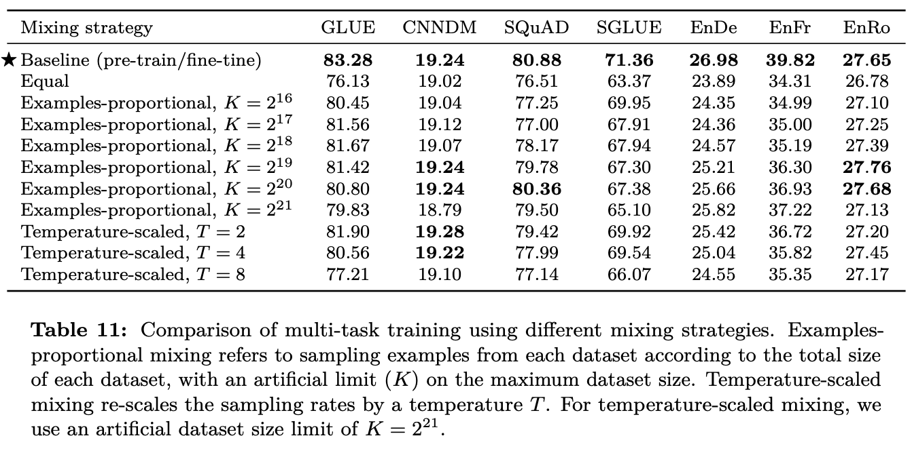

    ### 3.5.3 Combining multi-task learning with fine-tuning

    1. 현재 우리가 하고 있는 것은 이미 느슨한 형태의 multi-task learning 임
        - 하나의 모델을 비지도로 한번에 사전 학습(다양한 테스크 데이터로)하고 각 테스크 별로 독립적으로 지도 방법으로 파인 튜닝 하기 때문에.
    2. 이 어프로치를 3가지 형태로 확장해서 테스트 하고자 함.
        - Multi-task pre-training + fine-tuning
            - Pre-Training : Example-proportional mixtrure(K = 2^19)
            - Fine-Tuning : 테스크 별로 독립적으로.
        - Leave-one-out Multi-task pre-training
            - Pre-Training시에 하나의 테스크 데이터를 빼고,
            - Fine-Tuning시에 그 테스크에 대해서 튜닝 진행
        - Supervised multi-task pre-training
            - Pre-Training : Supervised with K = 2^19
            - Fine-Tuning 독립적으로.
    3. 결과
        - 첫번째 방법과 그냥 Unsupervised 방법과 비슷한 성능을 보임
            - 학습 속도 측면에서는 도움이 될수 있음을 보여주는 결과

                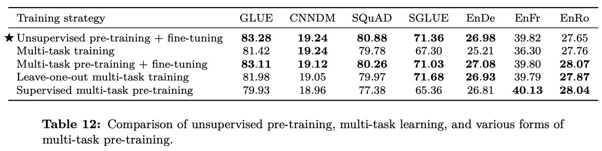

## 3.6 Scaling

1. NLP 도메인에서 계산 요소들의 Scaile up은 성능 향상을 가져옴을 최근 연구들을 통해 알 수 있음.
    - 고려 요소 : 레이어 사이즈, 배치 사이즈, 트레이닝 스텝, 앙상블(싸게 하려고 파인튜닝만..)
2. 묻고싶다... "4배의 연산량을 감수하고도 이걸 쓸껀지?"

    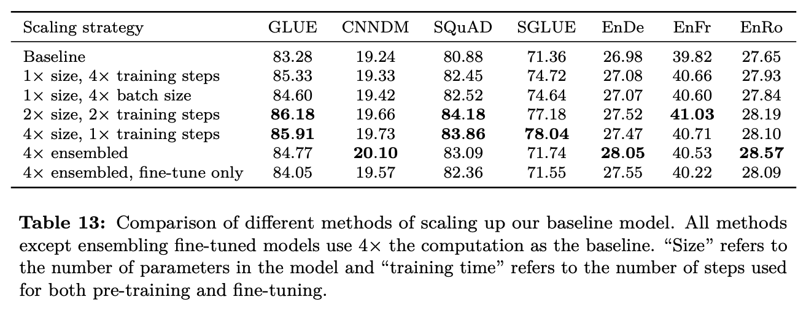

## 3.7 Putting it all together

1. Objective
    - SpanBERT에서 영향을 받은 i.i.d denosing objective 성능 좋음
    - Span length 3 & corrupt 15% 진행
2. Longer training
    - Baseline 데이터는 상대적으로 작음 (버트의 1/4, 엑셀넷 1/16, 로베르타의 1/64)
    - 데이터의 반복이 필요없는 C4의 충분한 데이터가 있음
    - Section 3.6에서 pre-training을 추가하는 것이 도움이 되었고, 배치 사이즈의 증가와 training의 증가가 역시 도움이 되었음
    - 3.4.1에서는 RealNews-like, WebText-like, Wiki+TBC가 C4로 pre-training하는 것보다 몇몇 downstream에서 좋은 성능.
    - 하지만 위의 데이터셋의 양이 데이터가 적기 때문에, 반복 학습이 필요하고, Section 3.4.2에서 말했던 것 처럼, 일정이상의 같은 데이터로 반복되는 학습은 오히려 안좋을 수 있음(암기효과)
    - 그래서 C4가 좋고, 그걸 사용함.
3. Model Size
    - Section 3.6에서 모델 사이즈의 크기가 성능을 향상시키는 것을 보여주었음
    - Base **:**  220 million parameters.
    - Small **:** 60 million parameters.
      ⇒ dmodel = 512, dff = 2,048, 8-headed attention, and only 6 layers
    - Large : 770 million parameters.
      ⇒ dmodel = 1024, dff = 4096, 16-headed attention, and only 12 layers
    - 3B : 2.8 billion parameters.
      ⇒ dff = 16,384 with 32-headed attention
    - 11B : 11 billion parameters.
      ⇒ dff = 65,536 with 128 headed attention
4. Multi-task pre-training
    - Section 3.5.3에서 지도/비지도 학습 테스크를 함께 Pre-training 하는 것이 비지도 학습만으로 Pre-training 하는 것 보다 좋다는 걸 보였다.
    - 이러면 심지어 Pre-training 하는 동안도 down-stream task 성능에 대해 모니터링이 가능
    - Example-proportional mixing 방법으로 Muti-task Pre-training을 진행하면 성능 뿐만 아니라, 속도 개선에서 도움이 된다.
    - 이러한 아이디어를 바탕으로 Unsupervied용 데이터의 크기를 제한
5. Fine-tuning on individual GLUE & SuperGLUE tasks
    - Fine-Tuning시 벤치 마크의 데이터 셋 내에 모든 테스크를 한번에 퉁쳐서 진행
        - 논리적으로 간단해 지지만, 성능이 약간 저하 됨.
        - GLUE나 SuperGLUE가 테스크가 많고, 각각의 데이터 크기가 차이가 큼(난이도 또한..)
    - 두 가지 방법
        - 배치 사이즈를 줄이고, 1000스텝 마다 체크 포인트를 저장
        ⇒ 각 테스크 별로 가장 성능이 좋은 체크포인트를 골라서 쓰도록 함.
        - 걍 독립적으로 Fine-Tuning 하는 테스크도 있음.
6. Beam search
    - Text-to-Text 특성상 모든 테스크의 결과물을 greedy decoding 방법을 사용.
    - WMT, Summarization의 성능 향상을 위해 beam-search 사용(W = 4,  a = 0.6)
7. Test Data
    - 실제 최종 테스트에 사용된 데이터에 대해서 설명. 아래는 해당 테스트 결과

    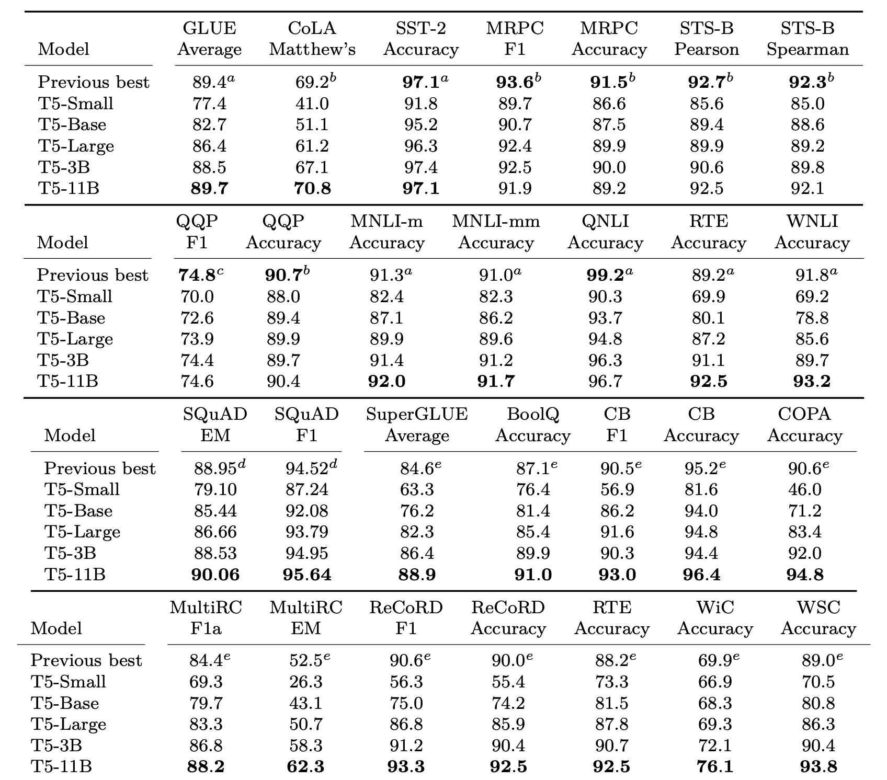

    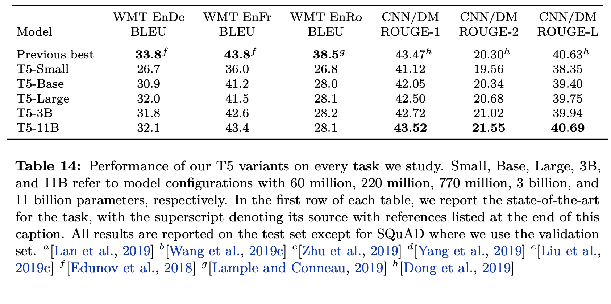
